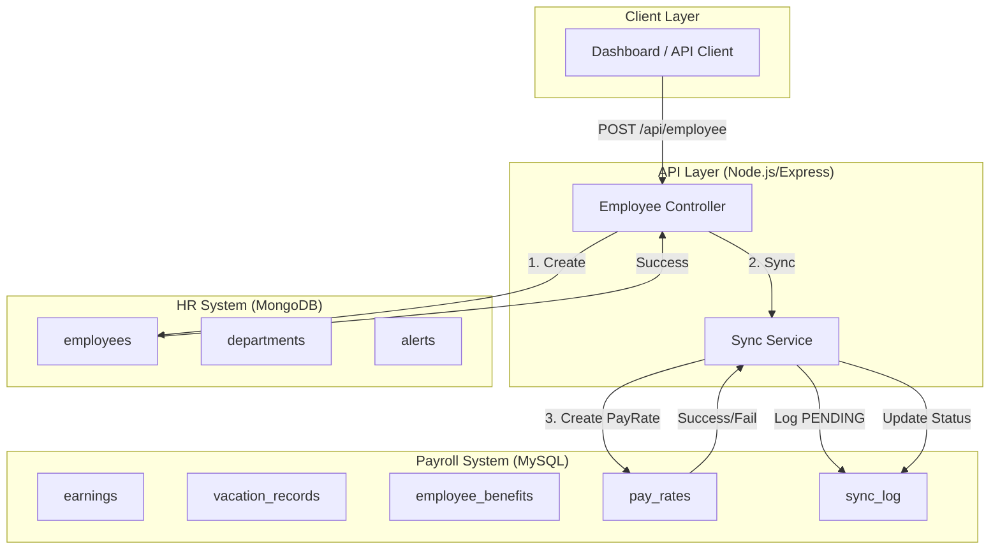

# Case Study 3 - Data Consistency Documentation

## 1. System Overview

This document describes the data consistency strategy between HR System (MongoDB) and Payroll System (MySQL).

---

## 2. Data Flow Diagram



---

## 3. Consistency Model

### Type: Eventual Consistency

| Property | Description |
|----------|-------------|
| **Model** | Eventual Consistency with retry |
| **Latency** | Sync within milliseconds (normal case) |
| **Durability** | Logged to sync_log even on failure |
| **Recovery** | Auto-retry via cron or manual trigger |

### Why NOT Strong Consistency?

1. **No 2-Phase Commit**: Too complex for academic scope
2. **Legacy Systems**: Cannot modify existing databases
3. **Performance**: Avoid distributed transaction overhead

---

## 4. CRUD Operations Flow

### CREATE Employee

```
┌─────────────────────────────────────────────────────────────┐
│                    CREATE EMPLOYEE FLOW                      │
├─────────────────────────────────────────────────────────────┤
│  1. Client sends POST /api/employee                         │
│  2. Controller validates input                              │
│  3. MongoDB: Insert employee document                       │
│  4. If MongoDB fails → Return error (no sync)               │
│  5. If MongoDB success → Call syncService                   │
│  6. SyncLog: Create PENDING record                          │
│  7. MySQL: Insert PayRate record                            │
│  8. If MySQL fails → SyncLog status = FAILED                │
│  9. If MySQL success → SyncLog status = SUCCESS             │
│ 10. Return response with sync status                        │
└─────────────────────────────────────────────────────────────┘
```

### UPDATE Employee

```
┌─────────────────────────────────────────────────────────────┐
│                    UPDATE EMPLOYEE FLOW                      │
├─────────────────────────────────────────────────────────────┤
│  1. Client sends PUT /api/employee/:id                      │
│  2. MongoDB: Update employee document                       │
│  3. If relevant fields changed (payRate) → Sync to MySQL    │
│  4. SyncLog: Log the update attempt                         │
└─────────────────────────────────────────────────────────────┘
```

### DELETE Employee

```
┌─────────────────────────────────────────────────────────────┐
│                    DELETE EMPLOYEE FLOW                      │
├─────────────────────────────────────────────────────────────┤
│  1. Client sends DELETE /api/employee/:id                   │
│  2. MongoDB: Delete employee document                       │
│  3. Sync: Log deletion (DO NOT delete payroll history)      │
│  4. Historical earnings/vacation data preserved             │
└─────────────────────────────────────────────────────────────┘
```

---

## 5. Failure Scenarios

### Scenario 1: MySQL Temporarily Unavailable

| Step | System State | Action |
|------|--------------|--------|
| 1 | MySQL down | Employee created in MongoDB |
| 2 | Sync attempted | Connection refused |
| 3 | SyncLog | status = FAILED, error_message logged |
| 4 | MySQL up | Cron/manual retry triggers |
| 5 | Retry success | SyncLog status = SUCCESS |

**User Experience**: Employee created, sync shown as "PENDING". Dashboard may show stale data until sync completes.

---

### Scenario 2: MongoDB Write Fails

| Step | System State | Action |
|------|--------------|--------|
| 1 | MongoDB error | Validation fails or disk full |
| 2 | Response | HTTP 500 returned |
| 3 | Sync | NOT triggered (MongoDB is source of truth) |

**User Experience**: Error message shown, no data inconsistency.

---

### Scenario 3: Partial Sync Failure

| Step | System State | Action |
|------|--------------|--------|
| 1 | MongoDB success | Employee created |
| 2 | SyncLog created | status = PENDING |
| 3 | MySQL timeout | Connection drops mid-query |
| 4 | SyncLog updated | status = FAILED |
| 5 | Retry logic | retry_count incremented |

**User Experience**: Employee exists but payroll not synced. System auto-retries.

---

### Scenario 4: Network Partition

| Duration | HR (MongoDB) | Payroll (MySQL) | Sync Status |
|----------|--------------|-----------------|-------------|
| 0-5 min | Read/Write OK | Read/Write OK | Normal |
| Partition | Read/Write OK | Unreachable | Writes logged as FAILED |
| Recovery | Read/Write OK | Read/Write OK | Auto-retry resumes |

---

## 6. Recovery Mechanisms

### Automatic Recovery

```javascript
// Cron job (recommended: every 5 minutes)
const cron = require('node-cron');
const { retryFailedSyncs } = require('./syncService');

cron.schedule('*/5 * * * *', async () => {
    console.log('[Cron] Retrying failed syncs...');
    const result = await retryFailedSyncs();
    console.log(`[Cron] Retried: ${result.retried}, Success: ${result.succeeded}`);
});
```

### Manual Recovery

```bash
# Check sync health
GET /api/sync/status

# View failed syncs
GET /api/sync/logs?status=FAILED

# Trigger manual retry
POST /api/sync/retry
```

---

## 7. Monitoring Dashboard (Future Enhancement)

| Metric | Description | Alert Threshold |
|--------|-------------|-----------------|
| Sync Success Rate | SUCCESS / Total | < 95% |
| Pending Queue | Count of PENDING | > 100 |
| Retry Failures | FAILED with retry_count >= 3 | > 0 |
| Avg Sync Latency | Time to SUCCESS | > 5s |

---

## 8. Limitations & Trade-offs

| Limitation | Reason | Mitigation |
|------------|--------|------------|
| No rollback if sync fails | MongoDB doesn't support distributed tx | Log and retry |
| Dashboard may show stale | Eventual consistency | Re-run aggregation |
| Max 3 retries | Prevent infinite loops | Manual intervention |
