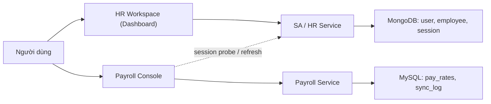
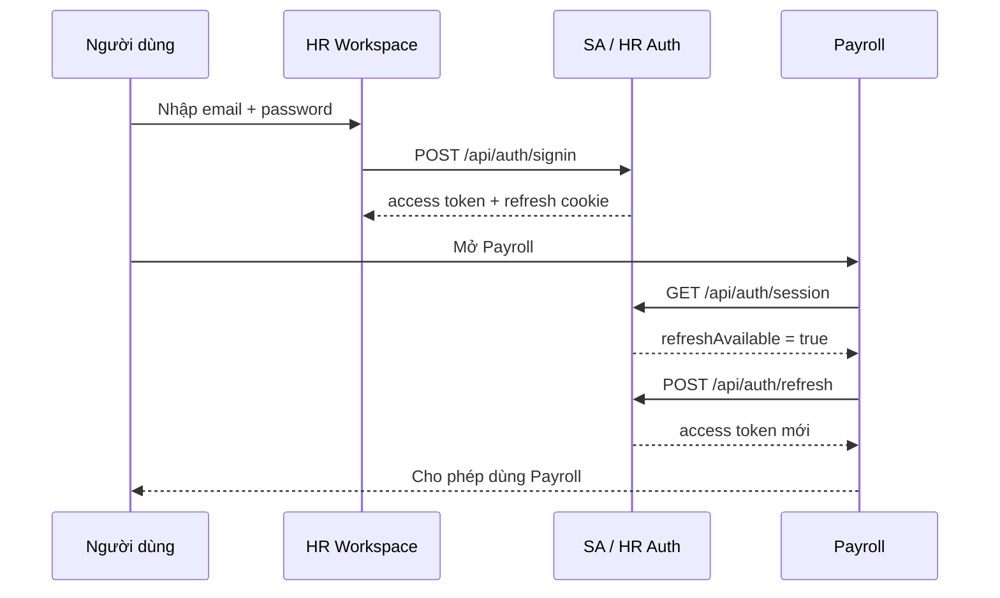
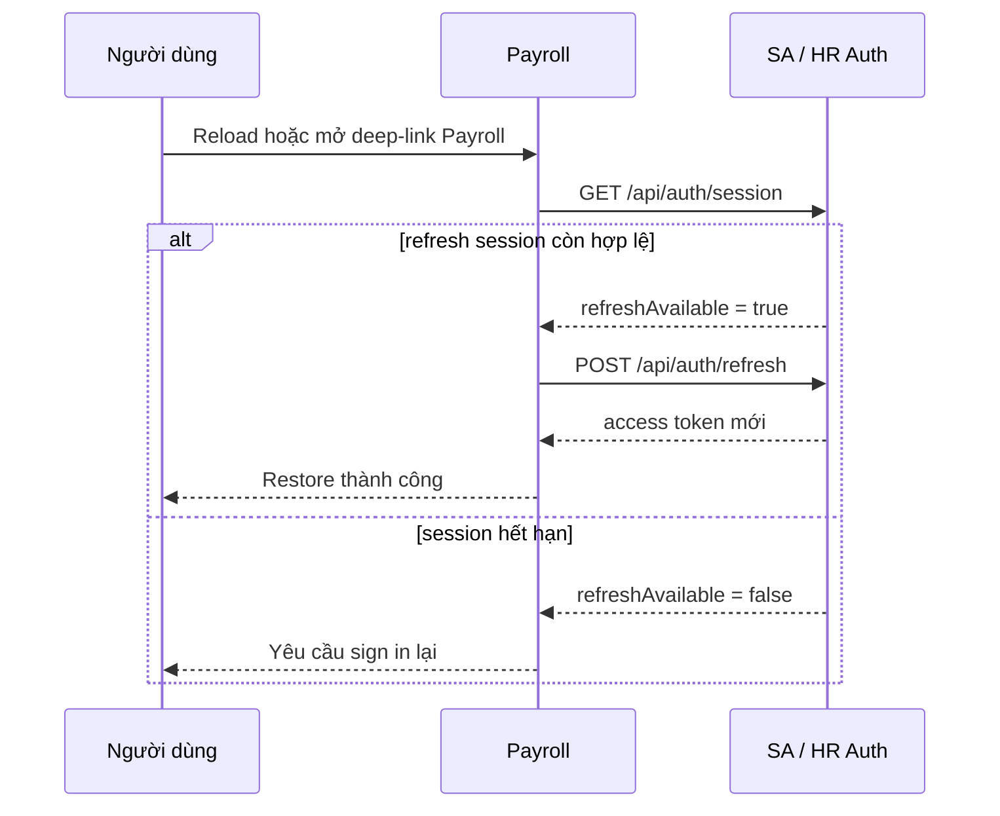
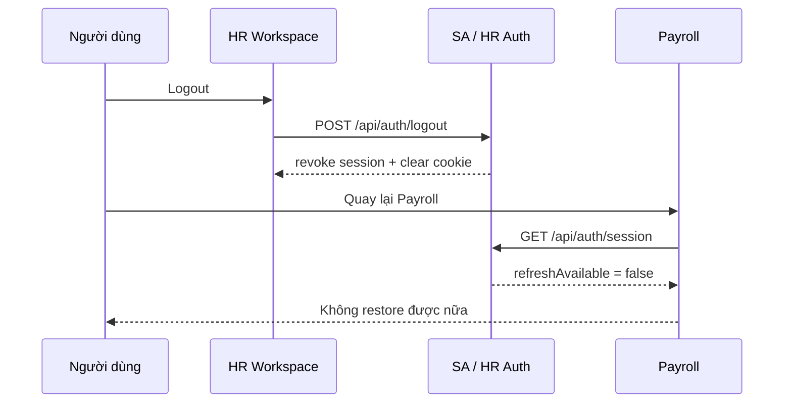

# BÁO CÁO HOMEWORK

## THIẾT KẾ VÀ XÂY DỰNG CƠ CHẾ SINGLE SIGN-ON GIỮA HR VÀ PAYROLL

---

## Thông tin sinh viên

- Môn học: .............................................................
- Giảng viên: ..........................................................
- Sinh viên: ...............................................................
- Mã sinh viên: .........................................................
- Ngày nộp: ...........................................................

---

## Tóm tắt

Bài homework yêu cầu phân tích hai hệ thống độc lập là `HR` và `Payroll`, sau đó xây dựng cơ chế `Single Sign-On (SSO)` để người dùng chỉ cần đăng nhập một lần nhưng vẫn có thể sử dụng hệ thống còn lại dưới cùng danh tính đã xác thực trước đó.

Trong codebase hiện tại, em triển khai mô hình `centralized JWT + refresh-cookie SSO`. Cách map đúng nhất với đề bài là:

- `HR system` = `Dashboard` (giao diện người dùng của workspace HR) + `SA / HR Service` (backend xác thực và nguồn dữ liệu gốc)
- `Payroll system` = `Payroll console` + `Payroll Service`
- `SA / HR auth` đóng vai trò `identity authority` cho cả hai hệ

Luồng hoạt động như sau:

- người dùng đăng nhập ở `HR workspace`
- `SA / HR Service` xác thực và cấp `access token` cùng `refresh session`
- khi mở `Payroll`, hệ thống kiểm tra session ở `SA`, khôi phục token nếu còn hợp lệ, và cho phép dùng tiếp dưới đúng identity đã đăng nhập
- khi logout, session dùng chung bị thu hồi và `Payroll` không thể tiếp tục restore phiên cũ

Giải pháp này không tự nhận là một hệ thống `OAuth2 / OIDC enterprise` đầy đủ, nhưng đủ gần mô hình thật, đủ an toàn cho phạm vi bài tập, và đủ rõ ràng để kiểm thử, demo, và bảo vệ trước giảng viên.

---

## 1. Giới thiệu bài toán

### 1.1 Bối cảnh

Trong hệ thống doanh nghiệp, `HR` và `Payroll` thường là hai hệ thống có trách nhiệm khác nhau:

- `HR` quản lý danh tính người dùng, hồ sơ nhân sự, phân quyền, và dữ liệu nguồn
- `Payroll` quản lý pay rate, bản ghi lương, và bằng chứng downstream

Nếu mỗi hệ thống yêu cầu đăng nhập riêng:

- người dùng phải nhập lại mật khẩu nhiều lần
- danh tính khó đồng bộ giữa các hệ
- việc quản lý vòng đời session không tập trung

Vì vậy, bài toán đặt ra là xây dựng cơ chế `Single Sign-On`, trong đó người dùng đăng nhập một lần ở một hệ thống rồi có thể sử dụng hệ thống còn lại mà không cần nhập lại mật khẩu.

### 1.2 Phát biểu bài toán

Cho hai hệ thống độc lập `HR` và `Payroll`, hãy:

- phân tích vai trò của từng hệ thống
- thiết kế cơ chế `SSO`
- cài đặt cơ chế đó
- giải thích lý do bảo mật
- chứng minh bằng demo/video rằng sau khi đăng nhập ở một hệ, người dùng có thể truy cập hệ còn lại với đúng danh tính tương ứng

### 1.3 Mục tiêu thực hiện

Em đặt ra các mục tiêu sau:

- đảm bảo `HR` và `Payroll` vẫn là hai runtime độc lập
- tập trung quyền xác thực tại `HR`
- để `Payroll` tái sử dụng phiên xác thực từ `HR`
- có luồng `signin`, `restore session`, `reload`, `deep-link`, `logout`, và `session expiry`
- có thể kiểm thử và demo được luồng SSO một cách rõ ràng

---

## 2. Mục tiêu và phạm vi

### 2.1 Mục tiêu chức năng

Hệ thống cần đáp ứng:

- người dùng đăng nhập tại `HR workspace`
- sau đó mở `Payroll` mà không cần nhập lại mật khẩu
- `Payroll` nhận đúng identity của người dùng
- reload hoặc mở deep-link vẫn giữ được quyền truy cập nếu session còn hợp lệ
- khi logout, session dùng chung mất hiệu lực

### 2.2 Mục tiêu phi chức năng

Giải pháp phải:

- đủ đơn giản để giải thích trước giảng viên
- đủ an toàn cho bối cảnh bài tập
- đủ rõ ràng để demo bằng video
- đủ gần hệ thống thật nhưng không thêm độ phức tạp giả tạo

### 2.3 Phạm vi

Báo cáo này tập trung vào:

- `Dashboard` như `HR workspace` cho người dùng
- `SA / HR Service` như auth authority và nguồn dữ liệu HR
- `Payroll console` và `Payroll Service`
- cơ chế đăng nhập và tái sử dụng session giữa hai hệ

### 2.4 Ngoài phạm vi

Em không đặt mục tiêu:

- xây dựng full `OAuth2 Authorization Server`
- triển khai `OIDC Discovery`, `JWKS`, hoặc `federation`
- triển khai hệ thống `IAM` production-grade nhiều domain

---

## 3. Phân tích hai hệ thống HR và Payroll

### 3.1 Hệ thống HR

Trong repo hiện tại, `HR` không nên chỉ hiểu là `SA root landing`. Cách hiểu đúng là:

- `Dashboard` là giao diện workspace HR của người dùng
- `SA / HR Service` là backend xác thực và quản lý dữ liệu HR

Vai trò của HR:

- quản lý đăng nhập
- cấp access token
- quản lý refresh session
- quản lý người dùng
- quản lý dữ liệu nhân sự nguồn

Các route auth quan trọng:

- `POST /api/auth/signin`
- `GET /api/auth/session`
- `POST /api/auth/refresh`
- `POST /api/auth/logout`
- `GET /api/auth/me`

Các thành phần mã nguồn chính:

- `src/controllers/auth.controller.js`
- `src/routes/auth.routes.js`
- `src/middlewares/authJwt.js`
- `dashboard/src/pages/Login.jsx`

### 3.2 Hệ thống Payroll

`Payroll system` là một hệ độc lập gồm:

- `Payroll console` cho người dùng
- `Payroll Service` cho API và dữ liệu downstream

Vai trò của hệ thống:

- hiển thị console payroll
- tra cứu pay rate theo `employeeId`
- hiển thị sync log và downstream evidence
- xác minh quyền truy cập bằng access token do `SA` cấp

Các thành phần mã nguồn chính:

- `public/payroll-console/index.html`
- `public/payroll-console/app.js`
- `public/payroll-console/sessionFlow.js`
- `src/routes/payroll.routes.js`
- `src/controllers/payroll.controller.js`

### 3.3 Tính độc lập giữa hai hệ thống

Hai hệ thống được xem là độc lập vì:

- chạy ở port khác nhau
- có giao diện khác nhau
- có route khác nhau
- có trách nhiệm nghiệp vụ khác nhau

Ví dụ:

- `HR workspace / Dashboard`: `http://127.0.0.1:4200`
- `SA / HR Service`: `http://127.0.0.1:4000`
- `Payroll`: `http://127.0.0.1:4100`

### 3.4 Vấn đề nếu chưa có SSO

Nếu không có SSO:

- người dùng phải đăng nhập lại ở `Payroll`
- password có thể bị nhập lặp ở nhiều nơi
- trải nghiệm không liền mạch
- khó quản lý vòng đời session và logout tập trung

---

## 4. Yêu cầu hệ thống SSO

### 4.1 Yêu cầu chức năng

Giải pháp SSO cần đảm bảo:

- login một lần tại `HR workspace`
- dùng được `Payroll` mà không cần nhập lại password
- user identity giữ nguyên
- có thể logout
- có thể restore session khi phiên còn hợp lệ

### 4.2 Yêu cầu bảo mật

Giải pháp phải:

- không truyền password sang `Payroll`
- có access token ngắn hạn
- có refresh session tách biệt
- có revoke/logout rõ ràng
- không để `Payroll` tự phát hành identity cho người dùng

### 4.3 Yêu cầu kiểm thử

Em cần kiểm chứng tối thiểu:

- đăng nhập thành công
- `Payroll` khôi phục được session
- reload hoặc deep-link vẫn vào được route bảo vệ nếu session còn hợp lệ
- logout xong thì không restore được nữa

---

## 5. Thiết kế kiến trúc SSO đề xuất

### 5.1 Kiến trúc được chọn

Em chọn mô hình:

`Centralized JWT + Refresh-Cookie SSO`

Hay mô tả ngắn gọn hơn:

`SSO tập trung phiên đăng nhập tại HR`

Ý tưởng chính:

- `SA / HR` là `identity authority`
- `Dashboard` là `HR workspace`
- `Payroll` là `relying system`
- access token dùng để gọi API bảo vệ
- refresh token dùng để khôi phục phiên

### 5.2 Sơ đồ kiến trúc

### 5.3 Trust boundary

Thiết kế này tách trust boundary như sau:

- password chỉ đi vào `HR / SA`
- `Payroll` không trực tiếp biết password
- `Payroll` chỉ dùng token do `SA` cấp
- `SA` là nơi duy nhất có quyền xác thực người dùng

### 5.4 Lý do chọn kiến trúc này

Em chọn kiến trúc này vì:

- bám sát đề bài hơn việc cho mỗi app đăng nhập riêng
- dễ giải thích trước giảng viên
- đủ gần hệ thống thật
- không cần dựng full enterprise auth server quá nặng cho phạm vi homework

---

## 6. Giải thuật SSO

### 6.1 Luồng đăng nhập lần đầu

### 6.2 Luồng restore session

### 6.3 Luồng logout

---

## 7. Cài đặt trong codebase

### 7.1 Cài đặt ở HR / SA

Các handler chính:

- `signinHandler`
- `refreshHandler`
- `sessionStatusHandler`
- `logoutHandler`

Điểm bảo mật chính:

- refresh token lưu bằng cookie `httpOnly`
- access token tách riêng
- session probe không trả access token trực tiếp
- logout có clear session

### 7.2 Cài đặt ở Payroll

Các hàm chính:

- `restoreSession()`
- `performSignIn()`
- `fetchWithSharedSession()`
- `sharedLogout()`

Ý nghĩa:

- `Payroll` không giữ password như hệ auth riêng
- `Payroll` tái sử dụng trust chain từ `SA`
- nếu access token mất hiệu lực thì thử restore trước khi fail

### 7.3 Cài đặt bảo vệ API

`Payroll` API được bảo vệ bởi middleware:

- `verifyToken`

Điều này chứng minh:

- SSO không chỉ dừng ở giao diện
- quyền truy cập thực sự được dùng để gọi API downstream

---

## 8. Lý do bảo mật

Em lựa chọn mô hình này vì các lý do sau:

### 8.1 Password chỉ đi vào HR

`Payroll` không xử lý password trực tiếp, nên:

- giảm bề mặt rủi ro
- đúng mô hình auth authority tập trung

### 8.2 Access token và refresh session tách biệt

- access token có thời hạn ngắn
- refresh session dùng riêng cho restore
- giảm rủi ro nếu access token bị lộ

### 8.3 Logout có thu hồi phiên

Hệ thống không chỉ sign in mà còn sign out hợp lệ:

- clear refresh cookie
- revoke session đang dùng
- ngăn `Payroll` restore session sau logout

### 8.4 Không over-claim

Em không tuyên bố:

- full `OAuth2 / OIDC enterprise`
- cross-domain production SSO
- multi-IdP federation

Tên gọi phù hợp nhất là:

- `centralized JWT + refresh-cookie SSO`
- hoặc `OIDC-lite centralized session restore`

---

## 9. Kiểm thử và demo

### 9.1 Kết quả audit source ngày 2026-04-24

Khi rà lại source cho bản nộp cá nhân, em xác nhận các nhóm kiểm thử chính sau:

- `npm run lint`: pass
- `npm --prefix dashboard run verify:frontend`: pass
- targeted backend contracts cho auth/session/runtime hardening/rate-limit/payroll console: pass `41/41`
- `npm run verify:case3`: pass luồng end-to-end chính

Lưu ý trung thực: full `npm run verify:backend` có thể mất nhiều thời gian trong môi trường local, nên phần bằng chứng chốt dùng thêm targeted contracts thay vì chỉ claim một lệnh tổng hợp.

### 9.2 Smoke verification

Repo có browser smoke cho SSO:

- `npm run verify:case3:browser-auth`

Luồng smoke kiểm tra:

- sign in
- vào protected route
- reload protected route
- deep-link protected route
- xác nhận refresh restore thành công
- logout và xác nhận session cũ không còn restore được

Ngoài ra, `npm run verify:case3` còn kiểm tra health/readiness của `SA`, `Payroll`, `Dashboard`, luồng source write sang payroll sync, và executive/dashboard proof flow.

### 9.3 Kịch bản demo đề xuất

Kịch bản tốt nhất để quay:

1. mở `HR workspace` và `Payroll`
2. chứng minh `Payroll` chưa có phiên
3. đăng nhập ở `HR`
4. sang `Payroll` và restore phiên
5. lookup một payroll record
6. reload `Payroll`
7. logout ở `HR`
8. quay lại `Payroll` và chứng minh session không còn restore được
9. làm thêm chiều ngược lại `Payroll -> HR` để tăng độ thuyết phục

---

## 10. Kết quả đạt được

Em đã đạt được:

- hai hệ thống độc lập về runtime
- auth authority tập trung ở `HR / SA`
- `Payroll` tái sử dụng session từ `HR`
- protected API thật
- smoke verification cho browser auth restore
- bộ tài liệu và script demo đủ để nộp bài chắc tay

---

## 11. Hạn chế

Giải pháp hiện tại chưa nhằm tới:

- chuẩn `OIDC discovery`
- `JWKS` hoặc key rotation production-grade
- federation giữa nhiều identity provider
- cross-domain internet-scale SSO

Tuy nhiên, trong phạm vi homework, giải pháp này:

- đúng trọng tâm đề bài
- đủ gần hệ thống thật
- đủ rõ ràng để kiểm chứng
- đủ mạnh để bảo vệ trước giảng viên

---

## 12. Kết luận

Em đã phân tích đúng vai trò của hai hệ thống `HR` và `Payroll`, sau đó thiết kế và cài đặt cơ chế `Single Sign-On` theo mô hình xác thực tập trung.

Điểm cốt lõi của giải pháp là:

- người dùng đăng nhập tại `HR workspace`
- `SA / HR` là nơi duy nhất xác thực người dùng
- `Payroll` tái sử dụng phiên xác thực thông qua `session probe + refresh`
- logout thu hồi được phiên dùng chung

So với một bài homework SSO cơ bản, giải pháp hiện tại mạnh hơn ở chỗ:

- có runtime thật tách biệt
- có protected API thật
- có smoke verification cho browser auth
- có thể demo cả reload, deep-link, restore, và logout

Vì vậy, em đánh giá giải pháp này đủ tốt để đáp ứng yêu cầu bài tập và đủ thuyết phục để trình bày như một mô hình SSO gần với hệ thống thực tế.
