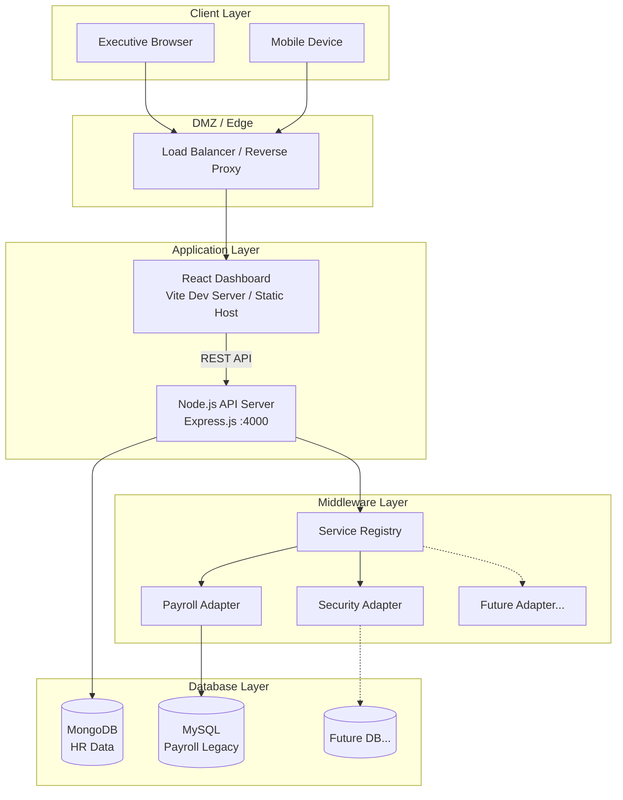

# Network Topology - SIP-CS Dashboard System

## Overview
This document describes the network architecture supporting the SIP-CS Executive Dashboard, addressing connectivity from executives to legacy databases.

## Architecture Diagram



## Network Segments

| Segment | Components | Security |
|---------|-----------|----------|
| **Client** | Executive browsers, Mobile | HTTPS only |
| **DMZ** | Load Balancer | SSL termination, Rate limiting |
| **App** | React FE, Express BE | JWT Auth, CORS |
| **Middleware** | Adapters | Internal only, no external exposure |
| **Data** | MongoDB, MySQL | Firewall protected, No public access |

## Connectivity Requirements

### Internet Outage Scenario (Q40)
- **LAN Access**: ✅ Full functionality within corporate network
- **Remote Access**: Via VPN → connects to internal Load Balancer
- **Cloud Dependency**: None. All systems are on-premises.

### Firewall Rules (Simplified)
```
ALLOW: Client → LB:443 (HTTPS)
ALLOW: LB → FE:3000, BE:4000
ALLOW: BE → MongoDB:27017, MySQL:3306
DENY: External → Database Layer (all)
```

## Key Design Decisions
1. **No direct FE-to-DB access** — All queries go through Express API
2. **Adapters are internal** — Not exposed to network, loaded at startup
3. **Legacy systems isolated** — MySQL accessed only via Payroll Adapter
